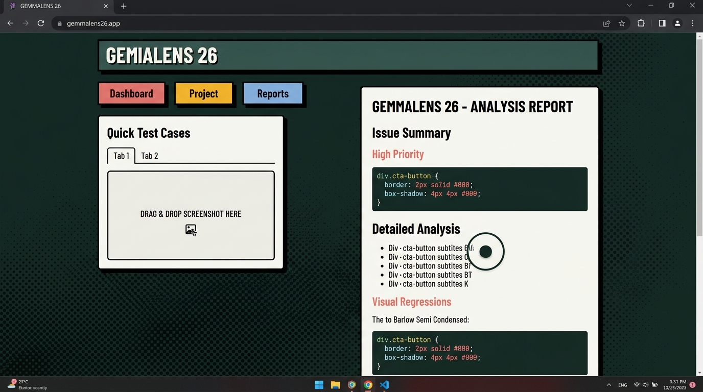

# 👁️ GemmaLens

**Automated Visual Defect Triage powered by Gemma 4**  
*Built for Hacktoberfest KBTCOE 2026 — Track 1: Best Use of Gemma 4*

---

## 🚀 The Problem: "The Bug That Only Exists on Screen"
Frontend developers waste hours trying to reproduce visual UI bugs based on vague user reports (e.g., *"The avatar looks squished on my phone"*). Without clear console errors, debugging CSS flexbox collisions, broken z-index stacking contexts, and mobile viewport blowouts is a tedious game of guess-and-check.

## 💡 The Solution
GemmaLens is a multimodal AI Quality Assurance engineer. Instead of hunting for the CSS failure, developers simply upload a screenshot of the broken UI. GemmaLens uses Google's `gemma-4-31b-it` model to analyze the spatial layout and DOM geometry, outputting:
1. **Visual Geometry Analysis:** Identifies overlapping boundaries and clipping.
2. **Root Cause Diagnosis:** Pinpoints the exact CSS/HTML structural failure.
3. **Actionable Code Patch:** Generates the precise CSS snippet required to fix the layout.

## 🖼️ Dashboard Preview


## 🎥 Demo Video
[Insert your YouTube/Vimeo Demo Link Here]

## 🛠️ Tech Stack
* **AI Model:** Google Gemma 4 (`gemma-4-31b-it`) via Gemini API
* **Backend:** Python, FastAPI, Uvicorn, Google GenAI SDK
* **Frontend:** Vanilla JS, HTML5, Tailwind CSS
* **Parsing:** Marked.js (Markdown rendering)

---

## 🏁 Quickstart (Local Setup)

### 1. Clone the repository
```bash
git clone https://github.com/aTHaRVaVENJIX/gemmalens-hacktoberfest.git
cd gemmalens-hacktoberfest
```

### 2. Set up the Backend
```bash
cd backend
pip install -r requirements.txt
```

### 3. Configure Environment Variables
Create a `.env` file in the `backend/` directory and add your API key from Google AI Studio:
```env
GEMINI_API_KEY=your_google_ai_studio_api_key_here
```

### 4. Run the FastAPI Server
```bash
uvicorn main:app --reload --port 8000
```

### 5. Launch the Frontend
Open `frontend/index.html` in any modern web browser or serve it locally:
```bash
cd ../frontend
python -m http.server 3000
```
Navigate to `http://localhost:3000`.

---

## 🧪 The Judge Test Suite
To evaluate the model's accuracy, the application features a built-in Judge Test Suite. Click any of the Quick Test Cases in the UI to instantly load deterministic UI failure modes (Flex Overlap, Modal Z-Clip, or Mobile 100vw Overflow) and watch Gemma 4 synthesize the correct patch.

---

Developed by Atharva for Hacktoberfest Nashik 2026. License: MIT.
